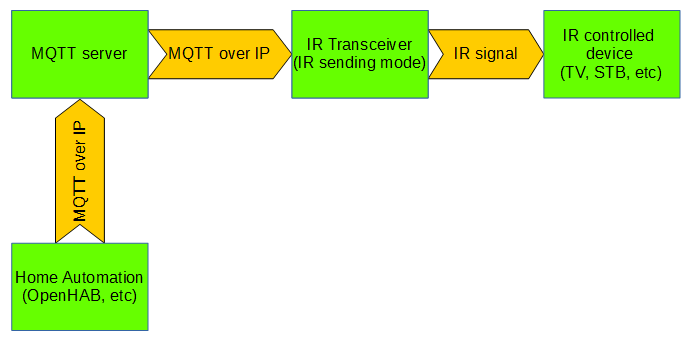
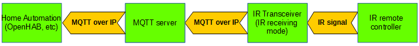

# MQTT IR transceiver

ESP8266 based gateway between MQTT and IR. Code compatible with [PlatformIO](http://platformio.org/). Works with ESP-01 (debug mode have to be disabled in globals.h)

## Features

* Receiving of IR transmission and publish it as MQTT messages
* Receive MQTT messages and send IR signal (multiple formats supported - NEC, RC5, LG, SONY, [Global Cache](https://irdb.globalcache.com/Home/Database) )
* Storing raw IR messages on flash and transmitting via IR  
* Constant current IR LED emitter circuit (based on [Analysir schematic](https://www.analysir.com/blog/2013/11/22/constant-current-infrared-led-circuit/) )
* MQTT over SSL support (not tested)

##Working modes

###IR transmitting



###IR receiving



##Used librariers

* IRremoteESP8266 - https://github.com/markszabo/IRremoteESP8266/
* ArduinoJson - https://github.com/bblanchon/ArduinoJson
* PubSubClient - https://github.com/knolleary/pubsubclient
* WiFiManager - https://github.com/tzapu/WiFiManager

##Installation

###GPIO connections:
<table>
  <tr>
  <th>GPIO WEMOS</th>
  <th>GPIO ESP01</th>
  <th>Usage</th>
  </tr>
  <tr>
  <td>13</td>
  <td>0</td>
  <td>IR receiver</td>
  </tr>
  <tr>
  <td>14</td>
  <td>3 (Uart RX)</td>
  <td>IR LED - connected via simple transistor amplifier</td>
  </tr>
  <tr>
  <td>15 (to +3,3V)</td>
  <td>2 (to GND)</td>
  <td>Button - used for reset configuration</td>
  </tr>
  <tr>
  <td>2 (Wemos buildin)</td>
  <td>not used</td>
  <td>LED</td>
  </tr>
</table>

###Schematic


###BOM

* D1,D2 - 1N4148
* Q1 - NPN transistor
* IR1 - IR receiver
* IR LED1, IR LED2 - Infrared LED
* R1 - 3.3kΩ
* R2 - 2.5Ω

###Compilation and firmware uploading

[PlatformIO](http://platformio.org/) and [Atom editor](https://atom.io/) with PlatformIO IDE package are required. See [installation procedure](http://docs.platformio.org/en/stable/ide/atom.html#installation)

#### 1. Clone the Repository

``` bash
git clone https://github.com/enc-X/mqtt-ir-transceiver
```

or download  [repository](https://github.com/enc-X/mqtt-ir-transceiver/archive/master.zip)

#### 2. Import project to PlatformIO

Run Atom editor and in **PlatformIO** menu choose option **Open Project folder...**. Select folder with imported project.

#### 3. Setup serial Port
From the list with files in the left tab open the platformio.ini and change the **upload_port = com12** to the correct port with your ESP8266.

#### 4. Build binary file

In **PlatformIO** menu choose option **Build**

#### 5. Upload to ESP8266

Connect ESP to PC via serial adapter. In **PlatformIO** menu choose option **Upload**.

##Usage

### Configuration

During first boot device will act as AP with SSID **IRTRANS-XXXXXX**. Connect to this AP and go to http://192.168.4.1. Configure WIFI and MQTT paramters.

### Resetting configuration

If during boot device have is pressed, device will go to configuration mode.

### Controller → Device communication
<table>
  <tr>
    <th>Property</th>
    <th>Message format</th>
    <th>Description</th>
    <th>Example</th>
  </tr>
  <tr>
    <td>_mqtt_prefix_/sender/storeRaw/_store_id_</td>
    <td>\d+(,\d+)</td>
    <td>store raw codes sequence in slot no. _store_id_, last number is frequency in kHz</td>
    <td>Topic: "_mqtt_prefix_/sender/storeRaw/10" <br/> Message: "11,43,54,65,32" <br/> 32 - is frequency in kHz</td>
  </tr>
  <tr>
    <td>_mqtt_prefix_/sender/sendStoredRaw</td>
    <td>\d+</td>
    <td>Transmit via IR RAW code from provided slot</td>
    <td>Topic: "_mqtt_prefix_/sender/sendStoredRaw" <br/> Message: "1"</td>
  </tr>
  <tr>
    <td>_mqtt_prefix_/sender/sendStoredRawSequence</td>
    <td>\d+(,\d+)*</td>
    <td>Transmit via IR sequence of RAW codes from provided slots</td>
    <td>Topic: "_mqtt_prefix_/sender/sendStoredRawSequence" <br/> Message: "1,2,3"</td>
  </tr>
  <tr>
    <td>_mqtt_prefix_/sender/cmd</td>
    <td>(ls|sysinfo)</td>
    <td>Execute on device command, replay in topic _mqtt_prefix_/sender/cmd/result</td>
    <td>Topic: "_mqtt_prefix_/sender/cmd"<br/> Message: "sysinfo"</td>
  </tr>
  <tr>
    <td>_mqtt_prefix_/sender/rawMode</td>
    <td>(1|ON|true|.*)</td>
    <td>Turn on/off reporting to controller received by device IR raw codes</td>
    <td>Topic: "_mqtt_prefix_/sender/rawMode"<br/>Message: "1"</td>
  </tr>
  <tr>
    <td>_mqtt_prefix_/wipe</td>
    <td>.*</td>
    <td>Wipe configuration for next boot</td>
    <td>Topic: "_mqtt_prefix_/wipe"<br/>Message: "1"</td>
  </tr>
  <tr>    
    <td>_mqtt_prefix_/sender/(RC_5|RC_6|NEC|SAMSUNG|SONY|LG)/(\d+)</td>
    <td>\d+</td>
    <td>Send IR signal based on type</td>
    <td>Topic: "esp8266/02sender/RC_5/12"<br/>Message: "3294"</td>
  </tr>
  <tr>  
    <td>_mqtt_prefix_/sender/sendGC</td>
    <td>\d+(,\d+)</td>
    <td>Send Global Cache code</td>
    <td>Topic: "_mqtt_prefix_/sender/sendGC" <br/> Message: "32000,43,54,65,32,...."</td>
  </tr>
  <tr>  
    <td>_mqtt_prefix_/sender/sendRAW</td>
    <td>\d+(,\d+)</td>
    <td>Send RAW code with given frequency</td>
    <td>Topic: "_mqtt_prefix_/sender/sendRAW" <br/> Message: "9000,4550,550,600,600,600,...,32" <br/>32 is frequency in kHz</td>
  </tr>
</table>


### Device → Controller communication

<table>
  <tr>
    <th>Property</th>
    <th>Message format</th>
    <th>Direction</th>
    <th>Example</th>
  </tr>
    <tr>
    <td>_mqtt_prefix_/sender/cmd/result</td>
    <td>.*</td>
    <td>Result of command</td>
    <td></td>
  </tr>
  <tr>
    <td>_mqtt_prefix_/receiver/_type_/_bits_/_panas_addr_</td>
    <td>\d+(,\d+)*</td>
    <td>Send to controller received IR code</td>
    <td>Topic: "_mqtt_prefix_/receiver/RC_5/12"<br/>Message: "3294"</td>
  </tr>
  <tr>
    <td>_mqtt_prefix_/receiver/raw</td>
    <td>\d+(,\d+)*</td>
    <td>Send to controller received RAW IR code (only when RAW mode is enabled)</td>
    <td>Topic: "_mqtt_prefix_/receiver/raw"<br/>Message: "9000,4550,550,600,600,600,..."</td>
  </tr>
</table>

### Integration with OpenHab

* Run MQTT server (mosquitto is fine)
* Configure MQTT server for OpenHab transport
* Register IR Transceiver to the same MQTT server (for example MQTT prefix is 'esp8266/02')
* Example items configuration:
```java
Group gIR <own_ir> (All)
Switch   ir_philips_on
        "Philips Power" <own_ir> (gIR)
        {mqtt=">[mosquitto:esp8266/02/sender/RC5/12:command:ON:56]", autoupdate="false"}
Switch   ir_philips_volp
        "Vol+"  <own_ir> (gIR)
        {mqtt=">[mosquitto:esp8266/02/sender/RC5/12:command:ON:1040]", autoupdate="false"}
Number ir_in_lg
        "LG IR command [%d]"    <own_ir> (gIR)
        {mqtt="<[mosquitto:esp8266/02/receiver/NEC/32:state:default]"}
Switch ir_adb_star
        "ADB 0" <own_ir) (gIR)
        {mqtt=">[mosquitto:esp8266/02/sender/sendGC:command:ON:38000,1,37,8,34,8,75,8,44,8,106,8,50,8,50,8,39,8,81,8,525,8,34,8,60,8,29,8,44,8,44,8,44,8,29,8,29,8,3058,8,34,8,75,8,44,8,106,8,50,8,50,8,39,8,81,8,525,8,34,8,101,8,70,8,44,8,44,8,44,8,29,8,29,8,3058]", autoupdate="false"}
```
* Using in rules:
```java
rule lgTVturnInfoScreen
when
        Item ir_in_lg received update 551549190
then
        // Do somenting after button press
end

rule initIRmodule
when
        System started
then
        // Turn off Philips after system start
        postUpdate(ir_philips_on,OFF)

        // Switch LG TV to HDMI 1 by Global Cache code
        publish("mosquitto","esp8266/02/sender/sendGC","38000,1,69,343,172,21,22,21,22,21,65,21,22,21,22,21,22,21,22,21,22,21,65,21,65,21,22,21,65,21,65,21,65,21,65,21,65,21,22,21,65,21,65,21,65,21,22,21,22,21,65,21,65,21,65,21,22,21,22,21,22,21,65,21,65,21,22,21,22,21,1673,343,86,21,3732")
end
```
